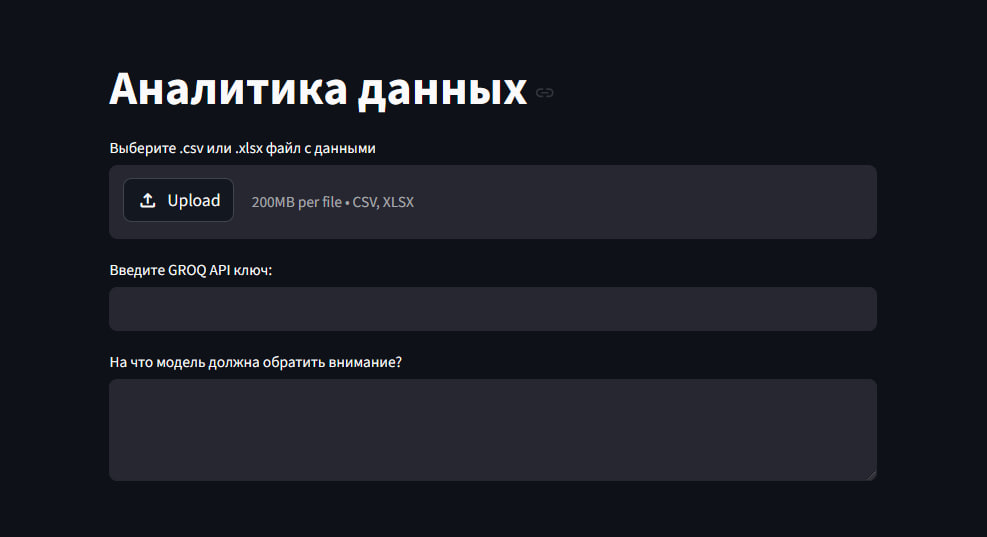
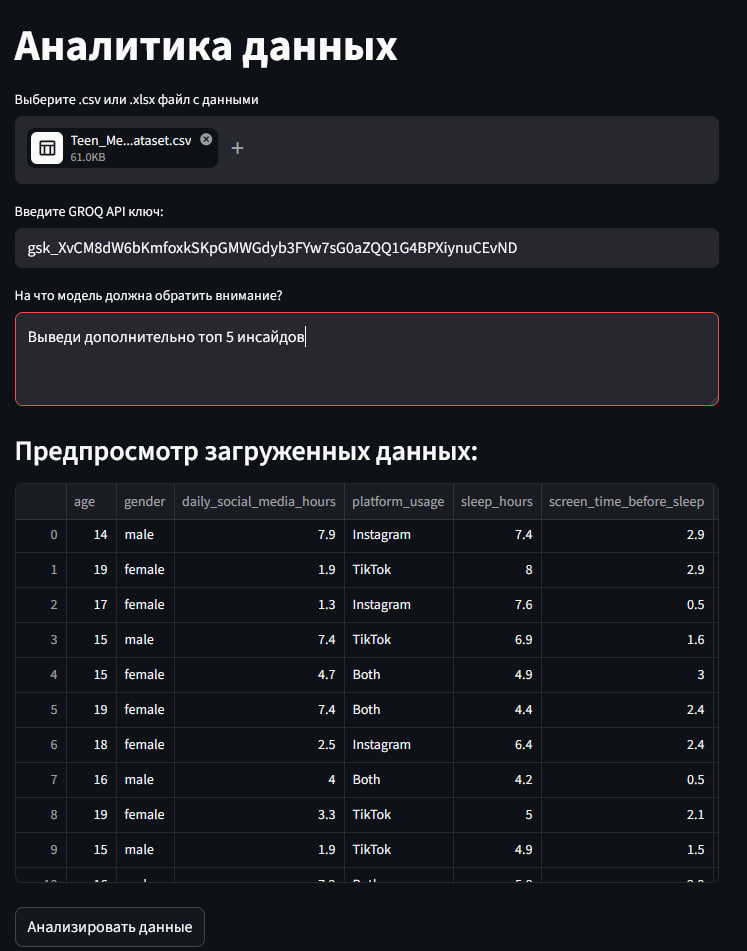
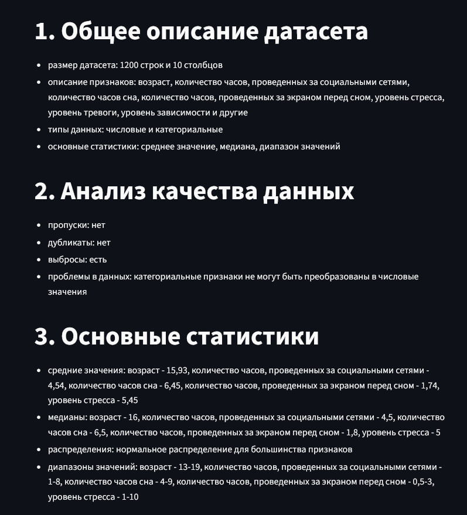
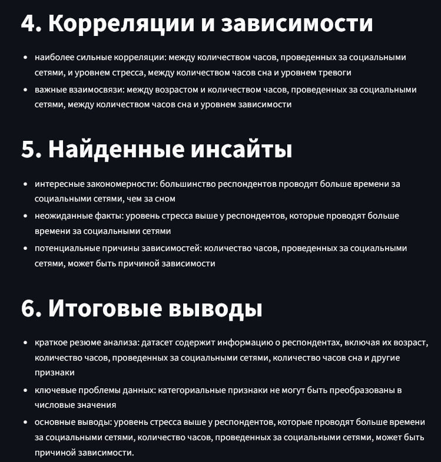
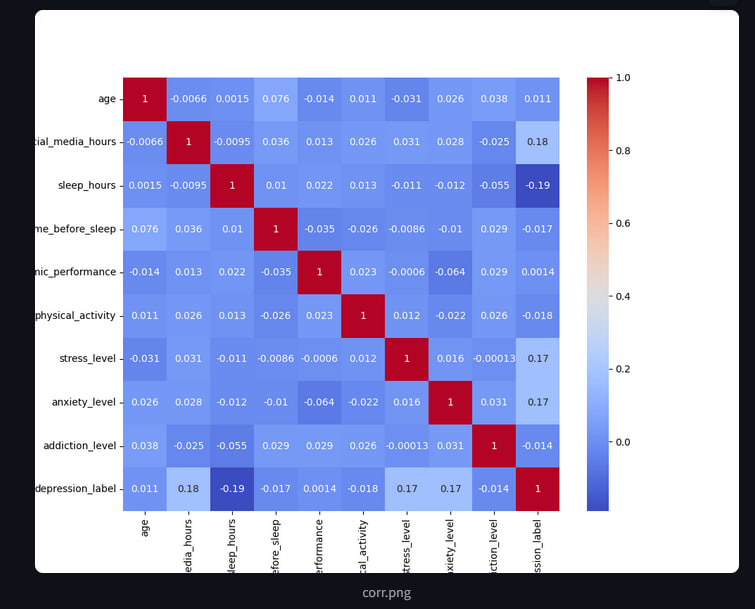
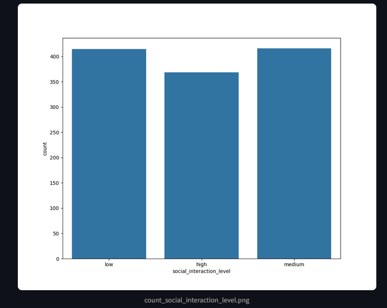

# Аналитика данных. Задание №3.

# Описание задачи: 

Создание веб-интерфейса на базе Streamlit для решения задачи анализа данных с помощью ИИ-агента. Веб-интерфейс должен позволять пользователю загрузить файл с данными и отображать результаты анализа данных.

# Структура проекта:

* app.py - Streamlit интерфейс
* agent.py - ИИ-агент и анализ данных
* security.py - защита от prompt injection
* charts/ - сгенерированные агентом графики
* images/ - изображения примера работы приложения
* requirements.txt - необходимые зависимости

# Особенности проекта
* LLM-агент на базе LangChain
* Использование Groq API (Llama 3.3 70B)
* Автоматический анализ данных
* Генерация графиков через matplotlib
* Поддержка пользовательских инструкций
* Базовая защита от prompt injection
* Поддержка двух форматов входных данных: .csv и .xlsx

# Используемые технологии

* Python 
* Pandas
* Matplotlib
* Streamlit
* LangChain
* Groq API
* Llama 3.3 70B

# Запуск проекта:

1. Склонировать репозиторий
```
git clone https://github.com/somuchddd/data_analysis_task3.git
```
2. Установить зависимости
```
pip install -r requirements.txt
```
3. Запустить Streamlit
```
streamlit run app.py
```
4. Получить Groq API ключ
5. Загрузить файл с данными, вставить API ключ в Streamlit интерфейс
6. Нажать кнопку **'Анализировать данные'**

# Пример работы
## Интерфейс



## Загруженные данные


## Пример ответа



## Примеры графиков



